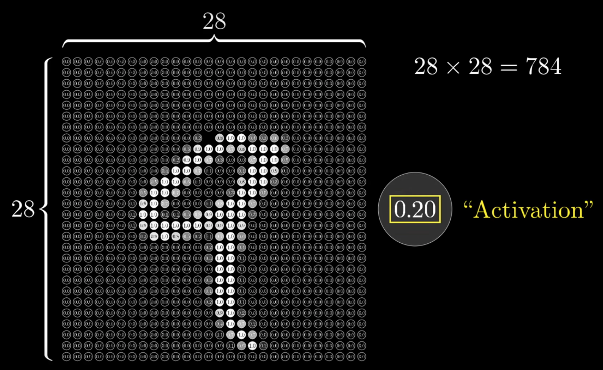
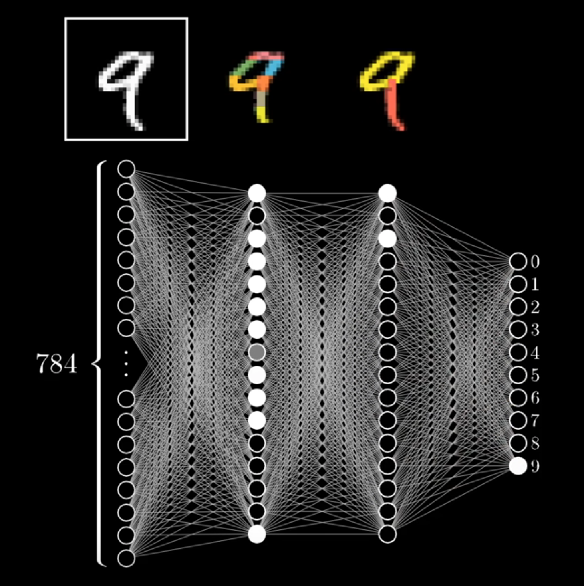

# Neural Networks

## Example: Neural Network recognizing a handwritten number from 0-9

### Reference:

* [Neural Networks Explained](https://www.youtube.com/watch?v=aircAruvnKk)

### Notes

* The image of the handwritten number consists of 28x28 pixels.
* This gives a total on 786 pixels
* Each pixel is a "neuron" and holds holds a number between 0 (black) and 1 (white)
* The number inside the neuron is called "activation"
* The whole of the 786 neurons ist the first layer of the network

* The last layer consist of 10 neurons (0-9), each with an "activation" between 0-1 that holds how likely it is, that the writter number equals to the neuron number.
* Inbetween the first and the last layer are "hidden layers". How many "hidden layers" there are, and how many "neurons" they have is open.
* Each layer produces a pattern that influences how the next layer reacts (I imagine like in Cellular Automata)
* Each layer breaks down the visual recognition of the number. For example: Layer 1 identifies small lines and edges. And Layer 2 identifies then loops and vertical strokes, which then combined give a 9 (and not a 8 because it consists of 2 loops and no stroke).

## References 

* [Linear Algebra](https://www.youtube.com/watch?v=kjBOesZCoqc&list=PL0-GT3co4r2y2YErbmuJw2L5tW4Ew2O5B)
